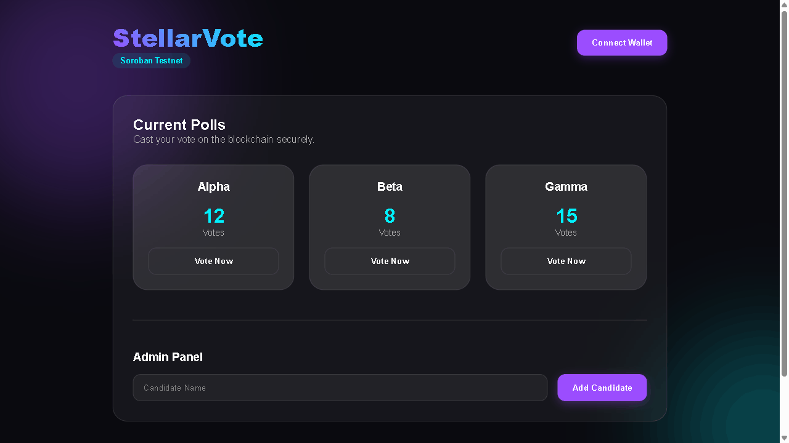

# StellarVote - Soroban Level 3 Mini-dApp

A decentralized, transparent, and secure voting platform built on the Stellar network using Soroban smart contracts.

## 🚀 Features
- **Decentralized Governance**: Fully on-chain voting logic.
- **Glassmorphic UI**: Modern, premium design built with React and Vanilla CSS.
- **Wallet Integration**: Seamless connection using the Stellar Freighter wallet.
- **Admin Controls**: Secure initialization and candidate management.
- **Anti-Fraud**: Built-in logic to prevent double voting and unauthorized candidate entry.

## 🛠 Tech Stack
- **Smart Contracts**: Rust & Soroban SDK
- **Frontend**: React (Vite), JavaScript
- **Styling**: Vanilla CSS (Custom Glassmorphism)
- **Tolls**: Stellar SDK, Freighter API

## 📂 Project Structure
- `/contracts/voting`: Soroban Rust contract and unit tests.
- `/frontend`: Vite + React application.

## 🚀 Submission Details
- **GitHub Repository**: [https://github.com/Harsh936132/steller-level3.git](https://github.com/Harsh936132/steller-level3.git)
- **Live Demo**: [https://steller-leve3.vercel.app/](https://steller-leve3.vercel.app/)
- **Demo Video**: 


## 📸 Test Output

*Output showing 3 tests passing in the smart contract.*

## 🧪 Testing details
The contract includes 3 comprehensive unit tests:
1. `test_voting_flow`: Validates the end-to-end flow of adding candidates and casting votes.
2. `test_double_voting`: Ensures a single address cannot vote more than once.
3. `test_double_init`: Prevents the contract from being initialized multiple times.

### How to Run Tests locally:
```bash
cd contracts/voting
cargo test
```

## 🏃 Run Locally
1. **Clone the repo**
2. **Install Frontend Dependencies**:
   ```bash
   cd frontend
   npm install
   ```
3. **Start Development Server**:
   ```bash
   npm run dev
   ```

## 📽 Demo


## 📝 Commit History
- `feat: Initial project structure and Soroban voting contract`
- `feat: Glassmorphic React frontend with Freighter integration`
- `test: Add contract unit tests for voting logic`
